# Informações do Projeto

`Parceiros para e-Games e Preço para jogos`

`Ciência da computação`

## Participantes

> Os membros do grupo são:

- Arthur Octavio Xavier Messias.
- João Vitor Antunes de Oliveira.
- Luiz Fernando Antunes da Silva Frassi.
- Lygia Araújo Barbosa Lott.
- Maria Clara Estelita de Almeida Bicalho da Cruz.
- Yuri de Oliveira Silva.

# Estrutura do Documento

- [Informações do Projeto](#informações-do-projeto)
  - [Participantes](#participantes)
- [Estrutura do Documento](#estrutura-do-documento)
- [Introdução](#introdução)
  - [Problema](#problema)
  - [Objetivos](#objetivos)
  - [Justificativa](#justificativa)
  - [Público-Alvo](#público-alvo)
- [Especificações do Projeto](#especificações-do-projeto)
  - [Personas e Mapas de Empatia](#personas-e-mapas-de-empatia)
  - [Histórias de Usuários](#histórias-de-usuários)
  - [Requisitos](#requisitos)
    - [Requisitos Funcionais](#requisitos-funcionais)
    - [Requisitos não Funcionais](#requisitos-não-funcionais)
  - [Restrições](#restrições)
- [Projeto de Interface](#projeto-de-interface)
  - [User Flow](#user-flow)
  - [Wireframes](#wireframes)
- [Metodologia](#metodologia)
  - [Divisão de Papéis](#divisão-de-papéis)
  - [Ferramentas](#ferramentas)
  - [Controle de Versão](#controle-de-versão)
- [**############## SPRINT 1 ACABA AQUI #############**](#-sprint-1-acaba-aqui-)
- [Projeto da Solução](#projeto-da-solução)
  - [Tecnologias Utilizadas](#tecnologias-utilizadas)
  - [Arquitetura da solução](#arquitetura-da-solução)
- [Avaliação da Aplicação](#avaliação-da-aplicação)
  - [Plano de Testes](#plano-de-testes)
  - [Ferramentas de Testes (Opcional)](#ferramentas-de-testes-opcional)
  - [Registros de Testes](#registros-de-testes)
- [Referências](#referências)

# Introdução

## Problema

O grande número de pessoas que jogam jogos de computadores atualmente permite que o usuário tenha um número imenso de opções de parceiros para jogar.
No momento de fazer essa escolha muitos parceiros infelizmente não se interagem de forma satisfatória e tornam a experiência de jogar juntos um problema.
Além disso, as características específicas de cada um torna a possibilidade de erro de triagem maior pois as necessidades deles são muito distintas.
Dessa maneira para resolver essa questão uma plataforma que possibilite uma discriminação certeira e eficaz tornaria tanto mais agradavel quanto mais veloz o encontro de parceiros em ambientes digitais.

> **Links Úteis**:
>
> - [Objetivos, Problema de pesquisa e Justificativa](https://medium.com/@versioparole/objetivos-problema-de-pesquisa-e-justificativa-c98c8233b9c3)
> - [Matriz Certezas, Suposições e Dúvidas](https://medium.com/educa%C3%A7%C3%A3o-fora-da-caixa/matriz-certezas-suposi%C3%A7%C3%B5es-e-d%C3%BAvidas-fa2263633655)
> - [Brainstorming](https://www.euax.com.br/2018/09/brainstorming/)

## Objetivos

- Criar uma aplicação onde integramos pessoas com interesses em jogos digitais para jogarem juntos
- Incentivar uma boa conduta em jogos digitais
- Incentivar interações sociais entre os usuarios para o desenvolvimento moral dos mesmos

> Aqui você deve descrever os objetivos do trabalho indicando que o
> objetivo geral é desenvolver um software para solucionar o problema
> apresentado acima. Apresente também alguns (pelo menos 2) objetivos
> específicos dependendo de onde você vai querer concentrar a sua
> prática investigativa, ou como você vai aprofundar no seu trabalho.
>
> **Links Úteis**:
>
> - [Objetivo geral e objetivo específico: como fazer e quais verbos utilizar](https://blog.mettzer.com/diferenca-entre-objetivo-geral-e-objetivo-especifico/)

## Justificativa

- A nossa aplicação tem como justificativa criar vinculos pessoais, principalmente em um momento pós pandemia onde procuramos ajudar na saúde mental e entrosamento com outras pessoas

> Descreva a importância ou a motivação para trabalhar com esta aplicação
> que você escolheu. Indique as razões pelas quais você escolheu seus
> objetivos específicos ou as razões para aprofundar em certos aspectos
> do software.
>
> O grupo de trabalho pode fazer uso de questionários, entrevistas e
> dados estatísticos, que podem ser apresentados, com o objetivo de
> esclarecer detalhes do problema que será abordado pelo grupo.
>
> **Links Úteis**:
>
> - [Como montar a justificativa](https://guiadamonografia.com.br/como-montar-justificativa-do-tcc/)

## Público-Alvo

- gênero: homens e mulheres
- faixa etária: entre 12 e 45 anos
- escolaridade: fundamental a pós-graduados
- faixa de renda: sem faixa de renda especifica
- classe social: A1, A2, B1, B2, C1, C2, D e E
- localização: Brasil e exterior
- hábitos de consumo: Apreciadores de jogo digitais

> Descreva quem serão as pessoas que usarão a sua aplicação indicando os
> diferentes perfis. O objetivo aqui não é definir quem serão os
> clientes ou quais serão os papéis dos usuários na aplicação. A ideia
> é, dentro do possível, conhecer um pouco mais sobre o perfil dos
> usuários: conhecimentos prévios, relação com a tecnologia, relações
> hierárquicas, etc.
>
> Adicione informações sobre o público-alvo por meio de uma descrição
> textual, ou diagramas de personas, mapa de stakeholders, ou como o
> grupo achar mais conveniente.
>
> **Links Úteis**:
>
> - [Público-alvo: o que é, tipos, como definir seu público e exemplos](https://klickpages.com.br/blog/publico-alvo-o-que-e/)
> - [Qual a diferença entre público-alvo e persona?](https://rockcontent.com/blog/diferenca-publico-alvo-e-persona/)

# Especificações do Projeto

- Servidor principal onde é armazenado todos os dados de usuarios
- Equipe de desenvolvimento e manutenção do projeto
- Serviço especializado em suporte para usuarios

> Apresente uma visão geral do que será abordado nesta parte do
> documento, enumerando as técnicas e/ou ferramentas utilizadas para
> realizar a especificações do projeto

## Personas e Mapas de Empatia

O problema foi idealizado inicialmente pensando nas próprias experiências dos membros e foi definido realmente após
entrevistas com alguns jogadores de diferentes faixas estárias, obtendo assim maior detalhamento da dor.
Os resultados obtidos foram transformados nos modelos de persona, mapas de empatia e histórias de usuário.

> Relacione as personas identificadas no seu projeto e os respectivos mapas de empatia. Lembre-se que
> você deve ser enumerar e descrever precisamente e de forma
> personalizada todos os principais envolvidos com a solução almeja.
>
> Para tanto, baseie-se tanto nos documentos disponibilizados na disciplina
> e/ou nos seguintes links:
>
> **Links Úteis**:
>
> - [Persona x Público-alvo](https://flammo.com.br/blog/persona-e-publico-alvo-qual-a-diferenca/)
> - [O que é persona?](https://resultadosdigitais.com.br/blog/persona-o-que-e/)
> - [Rock Content](https://rockcontent.com/blog/personas/)
> - [Hotmart](https://blog.hotmart.com/pt-br/como-criar-persona-negocio/)
> - [Mapa de Empatia](https://resultadosdigitais.com.br/blog/mapa-da-empatia/)
> - [Como fazer um mapa de empatia - Vídeo](https://www.youtube.com/watch?v=JlKHGpVoA2Y)
>
> **Pesona 1**
>
> 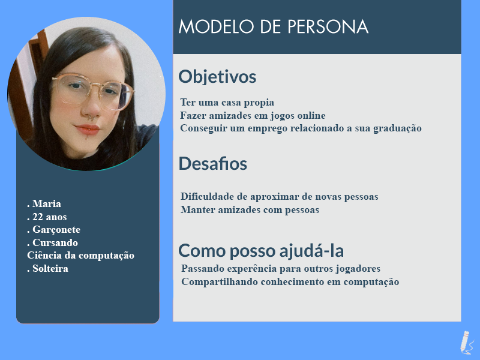
>
> > **Mapa 1**
>
> 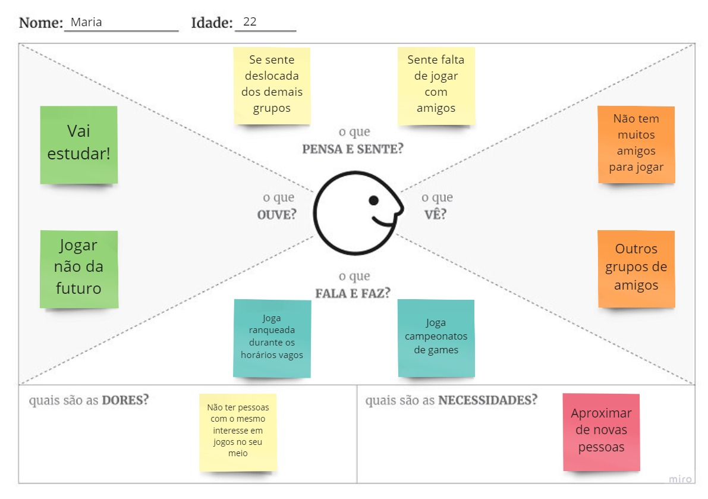
>
> > **Pesona 2**
>
> 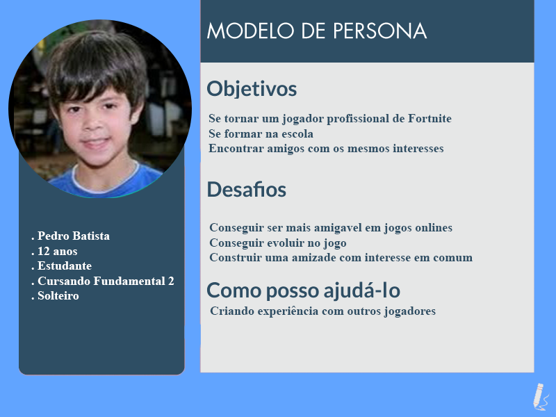
>
> > **Mapa 2**
>
> 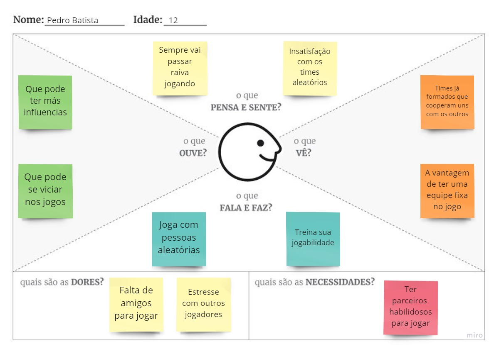
>
> > **Pesona 3**
>
> 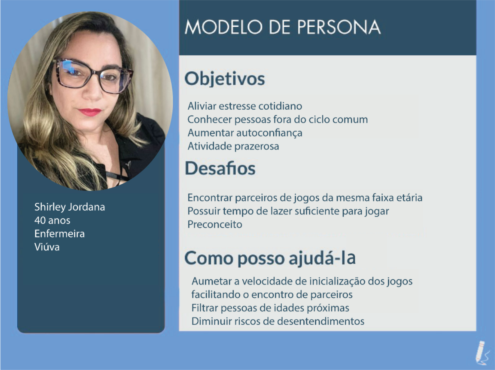
>
> > **Mapa 3**
>
> 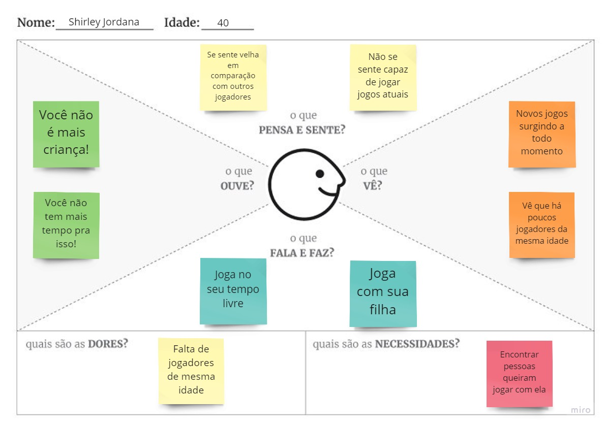
>
> Fonte: [Como criar uma persona para o seu negócio](https://raissaviegas.com.br/como-criar-uma-persona/)

## Histórias de Usuários

Com base na análise das personas forma identificadas as seguintes histórias de usuários:

| EU COMO... `PERSONA` | QUERO/PRECISO ... `FUNCIONALIDADE`        | PARA ... `MOTIVO/VALOR`        |
| -------------------- | ----------------------------------------- | ------------------------------ |
| Pedro Batista        | Encontrar jogadores habilidosos           | Não se estressar mais          |
| Pedro Batista        | Sorteios de VBucks                        | Poder comprar skins            |
| Maria                | Jogar com mais brasileiros                | Não receber insultos           |
| Maria                | Melhorar sua jogabilidade                 | Ganhar mais campeonatos        |
| Shirley Jordana      | Facilidade de encontrar parceiros         | Se divertir com outras pessoas |
| Shirley Jordana      | Encontrar pessoas que jogam jogos antigos | Poder compartilhar seus gostos |

> Apresente aqui as histórias de usuário que são relevantes para o
> projeto de sua solução. As Histórias de Usuário consistem em uma
> ferramenta poderosa para a compreensão e elicitação dos requisitos
> funcionais e não funcionais da sua aplicação. Se possível, agrupe as
> histórias de usuário por contexto, para facilitar consultas
> recorrentes à essa parte do documento.
>
> **Links Úteis**:
>
> - [Histórias de usuários com exemplos e template](https://www.atlassian.com/br/agile/project-management/user-stories)
> - [Como escrever boas histórias de usuário (User Stories)](https://medium.com/vertice/como-escrever-boas-users-stories-hist%C3%B3rias-de-usu%C3%A1rios-b29c75043fac)

## Requisitos

As tabelas que se seguem apresentam os requisitos funcionais e não funcionais que detalham o escopo do projeto.

### Requisitos Funcionais

| ID     | Descrição do Requisito               | Prioridade |
| ------ | ------------------------------------ | ---------- |
| RNF-01 | Programação                          | Alta       |
| RNF-02 | Software                             | Alta       |
| RNF-03 | Suporte a dispositivos IOS e Android | Média      |
| RNF-04 | Outras formas de ingresso            | Alta       |

### Requisitos não Funcionais

| ID    | Descrição do Requisito       | Prioridade |
| ----- | ---------------------------- | ---------- |
| RF-01 | Cadastro Perfil              | Alta       |
| RF-02 | Tela usuário                 | Média      |
| RF-03 | Escolha Idioma               | Média      |
| RF-04 | Cadastrar jogo               | Média      |
| RF-05 | Recomendação de jogos        | Alta       |
| RF-06 | Cadastro Gênero              | Alta       |
| RF-07 | Chat de Interação individual | Baixa      |
| RF-08 | Encontrar por habilidade     | Alta       |
| RF-09 | Encontrar por região         | Baixa      |
| RF-10 | Encontrar por plataforma     | Alta       |
| RF-11 | Encontrar por Idade          | Média      |
| RF-12 | Encontrar por linguagem      | Média      |
| RF-13 | Encontrar por jogo           | Baixa      |
| RF-14 | Encontrar por gênero de jogo | Média      |
| RF-15 | Prioridade de cada Filtro    | Baixa      |
| RF-16 | Solicitar amigo              | Média      |
| RF-17 | Encontrar jogador            | Baixa      |
| RF-18 | Avaliação jogadores          | Média      |
| RF-19 | Pagina suporte               | Média      |
| RF-20 | Monitores                    | Média      |

> Com base nas Histórias de Usuário, enumere os requisitos da sua
> solução. Classifique esses requisitos em dois grupos:
>
> - [Requisitos Funcionais (RF)](https://pt.wikipedia.org/wiki/Requisito_funcional):
>   interface
>   identificação de características pessoais
>   opção da língua a ser utilizada
>   escolha do jogo de preferência
>   seleção da experiência do parceiro no jogo

> plataforma (ex: cadastro de usuário).
>
> - [Requisitos Não Funcionais (RNF)](https://pt.wikipedia.org/wiki/Requisito_n%C3%A3o_funcional):
>   correspondem a uma característica técnica, seja de usabilidade,
>   desempenho, confiabilidade, segurança ou outro (ex: suporte a
>   dispositivos iOS e Android).
>
> Lembre-se que cada requisito deve corresponder à uma e somente uma
> característica alvo da sua solução. Além disso, certifique-se de que
> todos os aspectos capturados nas Histórias de Usuário foram cobertos.
>
> **Links Úteis**:
>
> - [O que são Requisitos Funcionais e Requisitos Não Funcionais?](https://codificar.com.br/requisitos-funcionais-nao-funcionais/)
> - [O que são requisitos funcionais e requisitos não funcionais?](https://analisederequisitos.com.br/requisitos-funcionais-e-requisitos-nao-funcionais-o-que-sao/)

## Restrições

O projeto está restrito pelos itens apresentados na tabela a seguir.

| ID  | Restrição                                             |
| --- | ----------------------------------------------------- |
| 01  | O projeto deverá ser entregue até o final do semestre |
| 02  | Não pode ser desenvolvido um módulo de backend        |
| 03  | O servidor não pode ser local                         |

> Enumere as restrições à sua solução. Lembre-se de que as restrições
> geralmente limitam a solução candidata.
>
> **Links Úteis**:
>
> - [O que são Requisitos Funcionais e Requisitos Não Funcionais?](https://codificar.com.br/requisitos-funcionais-nao-funcionais/)
> - [O que são requisitos funcionais e requisitos não funcionais?](https://analisederequisitos.com.br/requisitos-funcionais-e-requisitos-nao-funcionais-o-que-sao/)

# Projeto de Interface

A interface foi feita para acolher de forma amigavel e ter um visual chamativo ao usuario, onde colocamos cores complementares opostas, além de linguagens diferentes acolhendo a todos.

> Apresente as principais interfaces da solução. Discuta como
> foram elaboradas de forma a atender os requisitos funcionais, não
> funcionais e histórias de usuário abordados nas [Especificações do
> Projeto](#especificações-do-projeto).

## User Flow

> 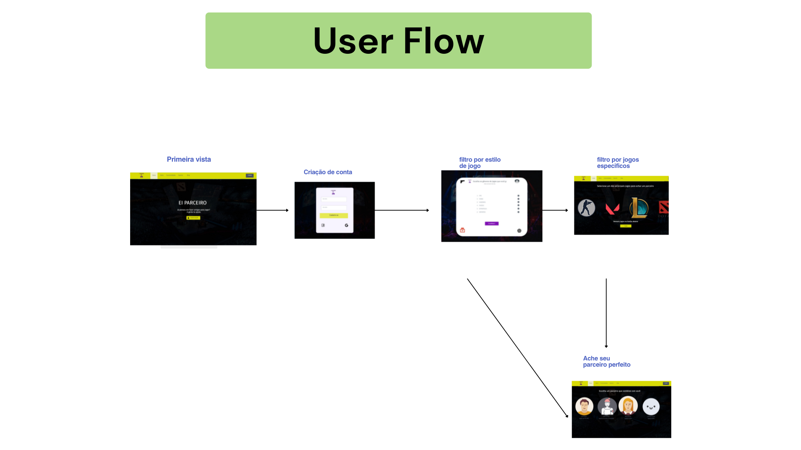

> Fluxo de usuário (User Flow) é uma técnica que permite ao desenvolvedor
> mapear todo fluxo de telas do site ou app. Essa técnica funciona
> para alinhar os caminhos e as possíveis ações que o usuário pode
> fazer junto com os membros de sua equipe.
>
> **Links Úteis**:
>
> - [User Flow: O Quê É e Como Fazer?](https://medium.com/7bits/fluxo-de-usu%C3%A1rio-user-flow-o-que-%C3%A9-como-fazer-79d965872534)
> - [User Flow vs Site Maps](http://designr.com.br/sitemap-e-user-flow-quais-as-diferencas-e-quando-usar-cada-um/)
> - [Top 25 User Flow Tools & Templates for Smooth](https://www.mockplus.com/blog/post/user-flow-tools)
>
> **Exemplo**:

## Wireframes

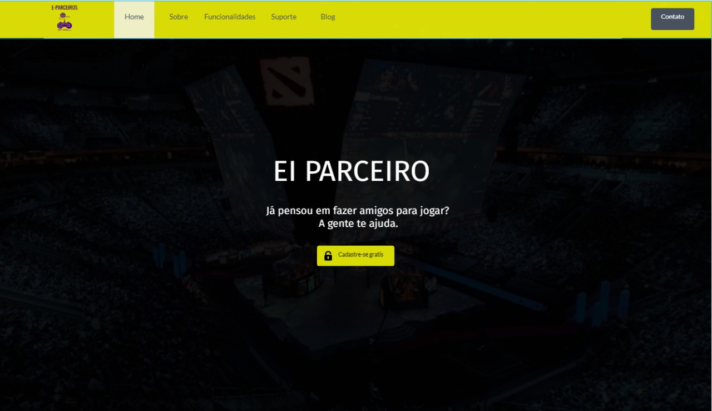
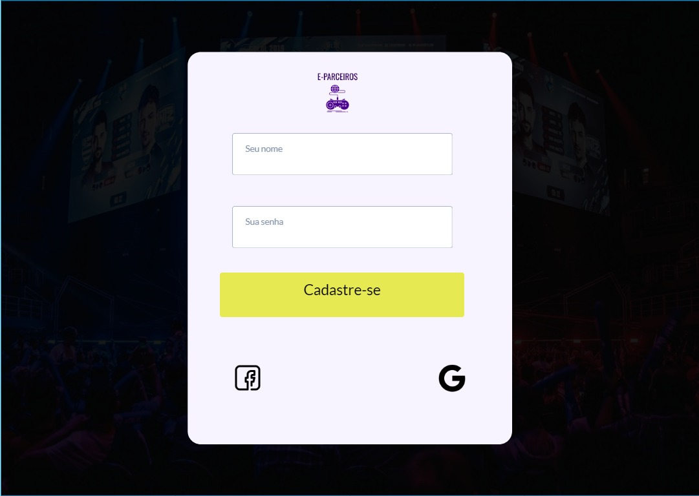
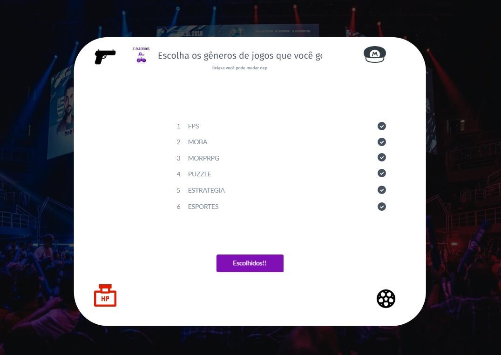
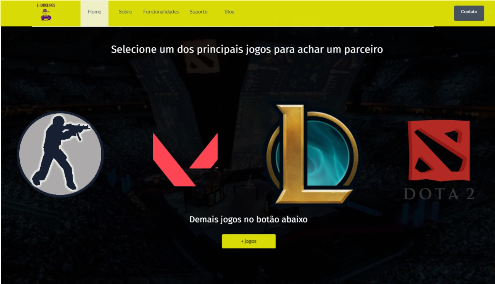
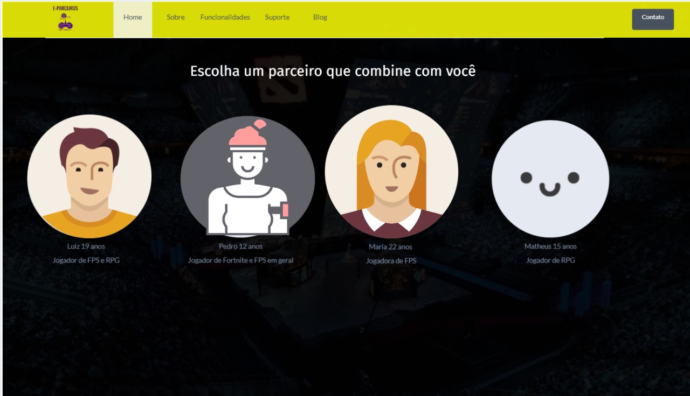

> Wireframes são protótipos das telas da aplicação usados em design de interface para sugerir a
> estrutura de um site web e seu relacionamentos entre suas
> páginas. Um wireframe web é uma ilustração semelhante ao
> layout de elementos fundamentais na interface.
>
> **Links Úteis**:
>
> - [Ferramentas de Wireframes](https://rockcontent.com/blog/wireframes/)
> - [Figma](https://www.figma.com/)
> - [Adobe XD](https://www.adobe.com/br/products/xd.html#scroll)
> - [MarvelApp](https://marvelapp.com/developers/documentation/tutorials/)

# Metodologia

- A metodologia ultilizada no projeto, teve como base uma divisão de tarefas especificas onde, no geral todos ajudaram no projeto como um todo, porem cada um pegou uma parte para focar.

> Nesta parte do documento, você deve apresentar a metodologia
> adotada pelo grupo, descrevendo o processo de trabalho baseado nas metodologias ágeis,
> a divisão de papéis e tarefas, as ferramentas empregadas e como foi realizada a
> gestão de configuração do projeto via GitHub.
>
> Coloque detalhes sobre o processo de Design Thinking e a implementação do Framework Scrum seguido
> pelo grupo. O grupo poderá fazer uso de ferramentas on-line para acompanhar
> o andamento do projeto, a execução das tarefas e o status de desenvolvimento
> da solução.
>
> **Links Úteis**:
>
> - [Tutorial Trello](https://trello.com/b/8AygzjUA/tutorial-trello)
> - [Gestão ágil de projetos com o Trello](https://www.youtube.com/watch?v=1o9BOMAKBRE)
> - [Gerência de projetos - Trello com Scrum](https://www.youtube.com/watch?v=DHLA8X_ujwo)
> - [Tutorial Slack](https://slack.com/intl/en-br/)

## Divisão de Papéis

- Arthur: miro, marvel app, relatório, pdf

- João Vitor: codigo, hospedando o site, miro, pdf

- Luiz Fernando: criação de persona, relatório

- Lygia: miro, logo, produção de imagens, apresentação

- Maria Clara Estelita: miro, relatório

- Yuri: logo, relatório, mapa de empatia

> Apresente a divisão de papéis e tarefas entre os membros do grupo.
>
> **Links Úteis**:
>
> - [11 Passos Essenciais para Implantar Scrum no seu Projeto](https://mindmaster.com.br/scrum-11-passos/)
> - [Scrum em 9 minutos](https://www.youtube.com/watch?v=XfvQWnRgxG0)

## Ferramentas

As ferramentas escolhidas foram as seguintes presentes na tabela, sendo algumas como o github já definidas
previamente pelo professor, porém o MarvelApp foi escolhido por sua simplicidade e dinamicidade.

| Ambiente                    | Plataforma | Link de Acesso                                                                           |
| --------------------------- | ---------- | ---------------------------------------------------------------------------------------- |
| Processo de Design Thinkgin | Miro       | https://miro.com/app/board/uXjVPVTKklw=/                                                 |
| Repositório de código       | GitHub     | https://github.com/ICEI-PUC-Minas-PMGCC-TI/tiaw-pmg-cc-t-20222-02-parceiros-para-e-games |
| Hospedagem do site          | Heroku     | https://XXXXXXX.herokuapp.com                                                            |
| Protótipo Interativo        | MavelApp   | https://marvelapp.com/prototype/65g4f8c                                                  |

> Liste as ferramentas empregadas no desenvolvimento do
> projeto, justificando a escolha delas, sempre que possível.
>
> As ferramentas empregadas no projeto são:
>
> - Visual Studio Code
> - Discord
> - Ferramentas de diagramação
> - Plataforma de hospedagem
> - Miro
> - GitHub
> - Google-apresentação
> - Illustrator
> - Photoshop
> - MarvelApp
>
> O editor de código foi escolhido porque os integrantes já o conheciam
> e tinham facilidade, assim como a ferramenta de comunicação utilizada.

> As ferramentas de comunicação utilizadas possuem
> integração semelhante e por isso foram selecionadas. Por fim, para criar
> diagramas utilizamos essa ferramenta por melhor captar as
> necessidades da nossa solução.
>
> **Links Úteis - Hospedagem**:
>
> - [Getting Started with Heroku](https://devcenter.heroku.com/start)
> - [Crie seu Site com o HostGator](https://www.hostgator.com.br/como-publicar-seu-site)
> - [GoDady](https://br.godaddy.com/how-to)
> - [GitHub Pages](https://pages.github.com/)

## Controle de Versão

- 1.0.0

> Discuta como a configuração do projeto foi feita na ferramenta de
> versionamento escolhida. Exponha como a gerência de tags, merges,
> commits e branchs é realizada. Discuta como a gerência de issues foi
> realizada.
> A ferramenta de controle de versão adotada no projeto foi o
> [Git](https://git-scm.com/), sendo que o [Github](https://github.com)
> foi utilizado para hospedagem do repositório `upstream`.
>
> O projeto segue a seguinte convenção para o nome de branchs:
>
> - `master`: versão estável já testada do software
> - `unstable`: versão já testada do software, porém instável
> - `testing`: versão em testes do software
> - `dev`: versão de desenvolvimento do software
>
> Quanto à gerência de issues, o projeto adota a seguinte convenção para
> etiquetas:
>
> - `bugfix`: uma funcionalidade encontra-se com problemas
> - `enhancement`: uma funcionalidade precisa ser melhorada
> - `feature`: uma nova funcionalidade precisa ser introduzida
>
> **Links Úteis**:
>
> - [Tutorial GitHub](https://guides.github.com/activities/hello-world/)
> - [Git e Github](https://www.youtube.com/playlist?list=PLHz_AreHm4dm7ZULPAmadvNhH6vk9oNZA)
> - [5 Git Workflows & Branching Strategy to deliver better code](https://zepel.io/blog/5-git-workflows-to-improve-development/)
>
> **Exemplo - GitHub Feature Branch Workflow**:
>
> 

# **############## SPRINT 1 ACABA AQUI #############**

# Projeto da Solução

- E-parceiros se propõe a criar uma interface de encontro de usuários de jogos que promove o encontro de parceiros ideais para cada um.
- A plataforma utilizaria características das pessoas como idade, tipo de jogo, experiência e nacionalidade para direcionar os jogadores a usuários com aspectos semelhantes.
- O aplicativo permite a escolha da língua de preferência do usuário facilitando a comunicação universal.
  -Por meio de parcerias e concessões com empresas e jogos as despesas de viabilidade seriam sanadas e investimentos a possibilitariam de prosperar.

## Tecnologias Utilizadas

...... COLOQUE AQUI O SEU TEXTO ......

> Descreva aqui qual(is) tecnologias você vai usar para resolver o seu
> problema, ou seja, implementar a sua solução. Liste todas as
> tecnologias envolvidas, linguagens a serem utilizadas, serviços web,
> frameworks, bibliotecas, IDEs de desenvolvimento, e ferramentas.
> Apresente também uma figura explicando como as tecnologias estão
> relacionadas ou como uma interação do usuário com o sistema vai ser
> conduzida, por onde ela passa até retornar uma resposta ao usuário.
>
> Inclua os diagramas de User Flow, esboços criados pelo grupo
> (stoyboards), além dos protótipos de telas (wireframes). Descreva cada
> item textualmente comentando e complementando o que está apresentado
> nas imagens.

## Arquitetura da solução

...... COLOQUE AQUI O SEU TEXTO E O DIAGRAMA DE ARQUITETURA .......

> Inclua um diagrama da solução e descreva os módulos e as tecnologias
> que fazem parte da solução. Discorra sobre o diagrama.
>
> **Exemplo do diagrama de Arquitetura**:
>
> 

# Avaliação da Aplicação

...... COLOQUE AQUI O SEU TEXTO ......

> Apresente os cenários de testes utilizados na realização dos testes da
> sua aplicação. Escolha cenários de testes que demonstrem os requisitos
> sendo satisfeitos.

## Plano de Testes

...... COLOQUE AQUI O SEU TEXTO ......

> Enumere quais cenários de testes foram selecionados para teste. Neste
> tópico o grupo deve detalhar quais funcionalidades avaliadas, o grupo
> de usuários que foi escolhido para participar do teste e as
> ferramentas utilizadas.
>
> **Links Úteis**:
>
> - [IBM - Criação e Geração de Planos de Teste](https://www.ibm.com/developerworks/br/local/rational/criacao_geracao_planos_testes_software/index.html)
> - [Práticas e Técnicas de Testes Ágeis](http://assiste.serpro.gov.br/serproagil/Apresenta/slides.pdf)
> - [Teste de Software: Conceitos e tipos de testes](https://blog.onedaytesting.com.br/teste-de-software/)

## Ferramentas de Testes (Opcional)

...... COLOQUE AQUI O SEU TEXTO ......

> Comente sobre as ferramentas de testes utilizadas.
>
> **Links Úteis**:
>
> - [Ferramentas de Test para Java Script](https://geekflare.com/javascript-unit-testing/)
> - [UX Tools](https://uxdesign.cc/ux-user-research-and-user-testing-tools-2d339d379dc7)

## Registros de Testes

...... COLOQUE AQUI O SEU TEXTO ......

> Discorra sobre os resultados do teste. Ressaltando pontos fortes e
> fracos identificados na solução. Comente como o grupo pretende atacar
> esses pontos nas próximas iterações. Apresente as falhas detectadas e
> as melhorias geradas a partir dos resultados obtidos nos testes.

# Referências

> A lista a seguir traz as referências utilizadas nesse trabalho. são elas:
> • Littlefield, A. Guia da metodologia ágil e scrum para iniciantes. 2016. Disponível em: https://blog.trello.com/br/scrum-metodologia-agil. Acessado em 22/11/2022...
> • por Bruno Salutes Noobly: saiba como encontrar pessoas para jogar com você. Disponível em: https://canaltech.com.br/apps/noobly-saiba-como-encontrar-pessoas-para-jogar-com-voce/. Acessado em 29/11/2022.
> • por Bruno Rodrigues Sherwa, o app que te ajuda a encontrar companheiros de equipe e treinadores. Disponível em: https://maisesports.com.br/conheca-sherwa-app-encontrar-parceiros-treinadores/. Acessado em 29/11/2022.
