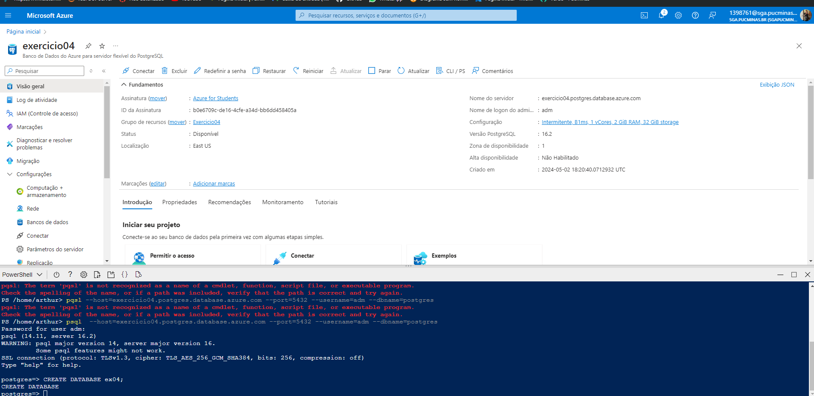
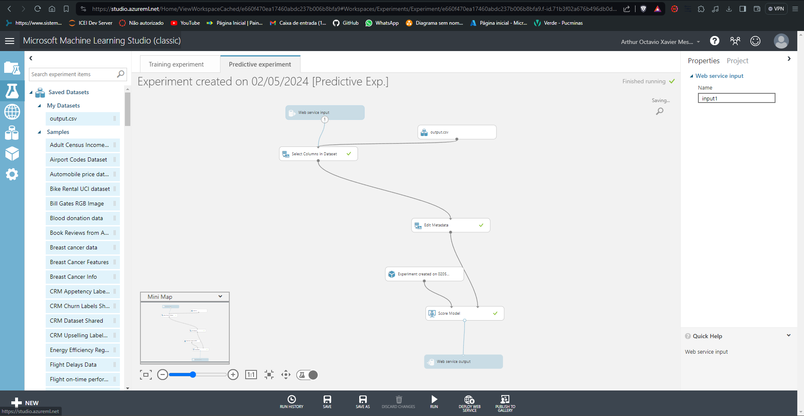

# Exercicio 04 💻

Este exercício demonstra a configuração e teste de conexão entre Java, SQL, e Machine Learning no Azure. Abaixo estão as capturas de tela e descrições detalhadas do processo.

## Conexão com Azure SQL 🌐
Configuração e teste de conexão com o Azure SQL utilizando Java.

## Implementação de Machine Learning 🤖
Integração do Machine Learning com o ambiente Azure, mostrando a configuração e os resultados dos testes.

## Configuração no VsCode e SQL 🖥️
Configuração do ambiente de desenvolvimento no VsCode para trabalhar com SQL e a integração com o Azure.

Este exercício demonstra a interoperabilidade entre diferentes tecnologias, utilizando o Azure como plataforma central para integração de serviços de dados e inteligência artificial.
